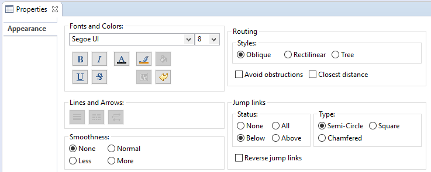
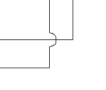
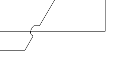
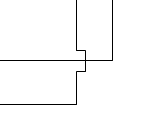
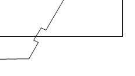
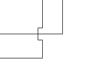
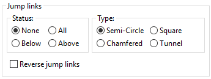
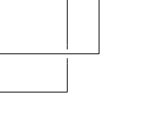
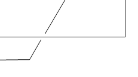

# Sirius Evolution Specification: New jump links type

## Preamble

_Summary_: Currently, Sirius proposes 3 types of jump links: "Semi-Circle", "Square" and "Chamfered". The goal of this feature is to offer a new type of jump links named "Tunnel".

| Version | Status    | Date       | Authors   | Changes             |
|---------|-----------|------------|-----------|---------------------|
|    v0.1 |  DRAFT    | 2019-12-04 |   lredor | Initial version.     |
|    v0.3 |  ACCEPTED | 2020-01-17 |   lredor | Changes after review |

_Relevant tickets_:
* [Bug 553775 - Provide a new type of jump links named "Tunnel"](https://bugs.eclipse.org/bugs/show_bug.cgi?id=553775): Sirius issue
* [Bug 553776 - Provide a new type of jump links named "Tunnel"](https://bugs.eclipse.org/bugs/show_bug.cgi?id=553776): Corresponding GMF issue as main part of this feature will be done directly in GMF.

## Introduction

Currently, when you select an edge, you can activate the "Jump Links" feature through the Sirius Appearance tab of the properties view by changing the jump links status.

**Status:**
* None: The jump links feature is disabled.
* All: A jump link is added for each intersection with another edge.
* Below: A jump link is added for each intersection with another edge that is below the current edge
* Above: A jump link is added for each intersection with another edge that is above the current edge

**Type**
There are currently 3 types of jump link:
* Semi-Circle

 
* Square

* Chamfered

The "Reverse jump links" only changes the side where the "jump" is drawn:

## Detailed Specification

The goal of this feature is to offer a new type of jump links named "Tunnel". This new type will complete the 3 existing types in the properties view:

The change concerning properties view will be done in `org.eclipse.gmf.runtime.diagram.ui.properties.sections.appearance.ConnectionAppearancePropertySection` inherited by `org.eclipse.sirius.diagram.ui.tools.internal.properties.DiagramConnectionAppearancePropertySection`.

Only a specific drawing will be necessary for this new type. For this type, we let a blank instead of the "semi-circle", "chamfered" or "square". To have a better visual aspect the blank will correspond to a half of a classical "jump".

This drawing will be handled in `org.eclipse.gmf.runtime.draw2d.ui.figures.PolylineConnectionEx` through method `outlineShape(Graphics)`.

All the behaviors will be the same than existing types. Here are some examples (list not necessarily exhaustive):
* Feature compatible with all routing: Oblique, Rectilinear and Tree.
* Property specific for each edge
* Style stored in the graphical model (aird file)

To resume, the main part of this feature will be done directly in GMF:
* GMF Notation for the meta-model change
* GMF Runtime for the properties view and the figure

## RCP/Web Flavors Compatibility and Interoperability

This feature will be available only in RCP as it is massively based on an existing GMF feature.

## Backward Compatibility and Migration Paths

Two new version of GMF (one for notation, one for runtime) will be released for this feature. So Sirius will have to consume these new versions.

No migration is necessary. But as soon as the new value is used, the model can not be opened with a previous version of Sirius. A migration participant that do nothing will be added to "change" the aird file version.

### Metamodel Changes

The Sirius metamodel will not be changed. The GMF metamodel will be changed to add a new Enum value to the type `org.eclipse.gmf.runtime.notation.JumpLinkType`:

`<eClassifiers xsi:type="ecore:EEnum" name="JumpLinkType">`

`    <eLiterals name="Semicircle"/>`

`    <eLiterals name="Square" value="1"/>`

`    <eLiterals name="Chamfered" value="2"/>`

`    ++<eLiterals name="Tunnel" value="3"/>`

`  </eClassifiers>`

A generation for the GMF CDO native part will be necessary. We must also consider the GMF CDO implementation hosted in the CDO repository. It will be probably impacted by this change.

### API Changes

No API change except the new above EEnum value.

### User Interface Changes

Only properties view will be changed to display the new jump link type.

### Documentation Changes

This new type must be documented in the New and Noteworthy documentation.
There is currently no Sirius documentation about "Jump links" feature so a full chapter must be added (in the section "Sirius/Sirius User Manual/Diagrams/Features Overview/Manage edges").

## Tests and Non-regression strategy

Manual tests must be added with the following matrix:
* each kind of routing style
* above and below another edge
* moving the edge through a creation of a new bendpoint
* moving the edge through a move of the source or/and the target

## Implementation choices and tradeoffs

There is no notion of transparency in the drawing. Only a "emtpy segment" is added instead of the "jump" of other type. This avoids to add new points computation.
