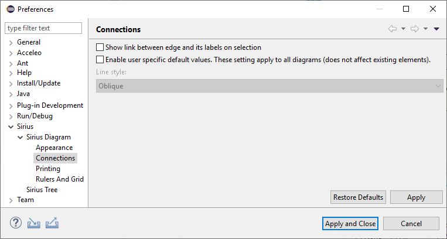
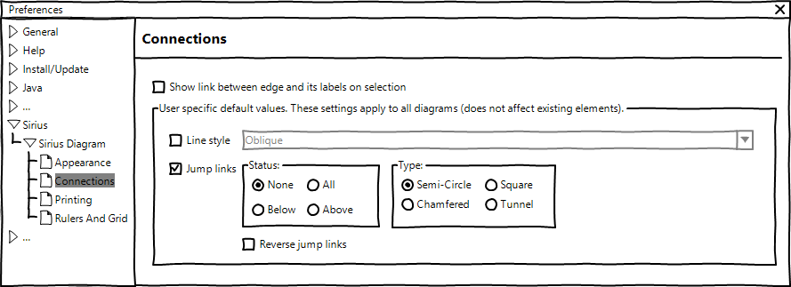

# Sirius Evolution Specification: Add preferences for Jump links properties

## Preamble

_Summary_: The goal of this feature is to allow end-user to initialize jump links properties of new edge with specific default values. These properties are: the status and the type of the jump links, and the reverse option.

| Version | Status    | Date       | Authors   | Changes                         |
|---------|-----------|------------|-----------|---------------------------------|
|    v0.1 |  DRAFT    | 2019-12-05 |    lredor | Initial version.                |
|    v0.2 |  DRAFT    | 2019-12-06 |    lredor | Change target preference page   |
|    v0.3 |  ACCEPTED | 2020-01-17 |    lredor | No change                       |

_Relevant tickets_:

* [Bug 553820 - Add preferences for Jump links properties](https://bugs.eclipse.org/bugs/show_bug.cgi?id=553820)

## Introduction

Currently, the end-user can define a default value for the routing style of all new edges by using the preference available in `Preferences>Sirius>Sirius Diagram>Connections`:

The goal of this feature is to add new preferences for all properties corresponding to jump links. Here is these properties (visible in the Appearance tab in the Properties view when an edge is selected): 

## Detailed Specification

The new preferences will be displayed like this:

These preferences values will be considered in `org.eclipse.sirius.diagram.ui.internal.view.factories.DEdgeViewFactory` during the creation of new edge.
Indeed, unlike the existing "Line style" preference, the new preferences will not be considered in the method `org.eclipse.sirius.diagram.business.internal.metamodel.helper.StyleHelper.updateEdgeStyle(EdgeStyleDescription, EdgeStyle, Option<EdgeStyle>)`, as the jump link properties are stored in the GMF part of the model and not in the Sirius part of the model.

If the end-user launches the action "Reset style properties by default values", the end-user jump link preferences must be used instead of the default Sirius values, ie:
* Status = None
* Type = Semi-Circle
* Reverse jump links = false

## RCP/Web Flavors Compatibility and Interoperability

This feature will be available only in RCP as it is based on existing GMF properties.

## Backward Compatibility and Migration Paths

There is no migration. This feature only allows to initialize default values that the end-user can already change manually for each edge.

### Metamodel Changes

No metamodel change.

### API Changes

New APIs will be added in `org.eclipse.sirius.diagram.tools.api.preferences.SiriusDiagramCorePreferences`. The existing `PREF_ENABLE_OVERRIDE` will probably be renamed according to new preferences (not mandatory, at least marked at deprecated).

### User Interface Changes

The changes concern only the preference page described above.
They will be done in`org.eclipse.sirius.diagram.ui.internal.preferences.DiagramConnectionsPreferencePage`.

### Documentation Changes

These new preferences must be documented in the New and Noteworthy documentation.
There is currently no Sirius documentation about default line style value. A full chapter concerning the line style default value and new jump link preferences must be added (in the section "Sirius/Sirius User Manual/Diagrams/Preferences").

## Tests and Non-regression strategy

The test class org.eclipse.sirius.tests.unit.api.routing.EdgeRoutingStyleEndUserOverrideTest can be completed with the new preferences.

## Implementation choices and tradeoffs

