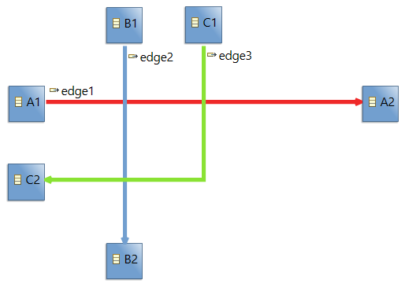
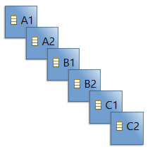
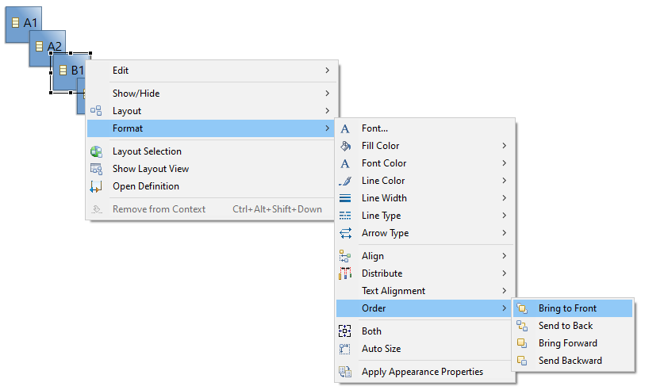
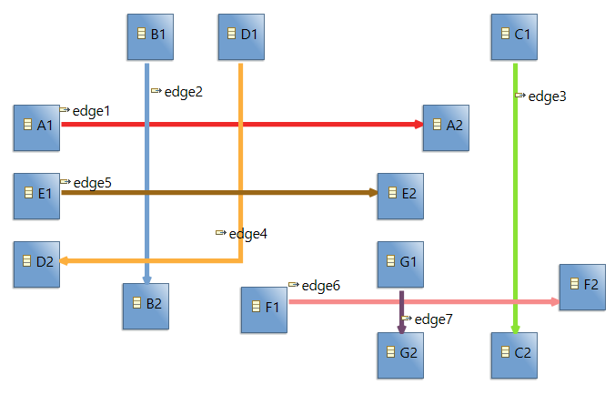
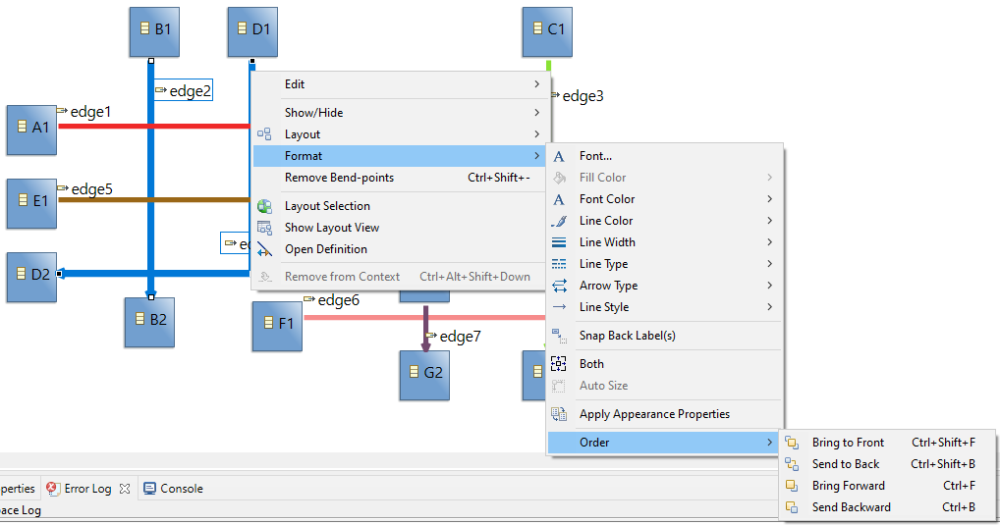

# Sirius Evolution Specification: Z-order management of edges

## Preamble

_Summary_: In Sirius, behavior inherited from GMF, it is possible to manage the "depth level" of a node, more commonly call the z-order (order of objects along the Z-axis). Similar behavior is not available for edges despite the fact that some features, like "jump links", rely on the z-order of edges. The goal of this evolution is to allow end-user to manager the z-order of edges to easily control where "jump links" are drawn.

| Version | Status | Date       | Authors   | Changes                         |
|---------|--------|------------|-----------|---------------------------------|
|    v0.1 |  DRAFT | 2021-06-16 |   lredor  | Initial version.                |
|    v0.2 |  DRAFT | 2021-06-21 |   lredor  | Changes after internal review.  |
|    v1.0 |  ACCEPTED | 2021-06-25 |   lredor  | Changes after customer review.  |

_Relevant tickets_ (links to the Bugzilla tickets which are related to the change):

* [Bug 574273 - Z-order management of edges](https://bugs.eclipse.org/bugs/show_bug.cgi?id=574273)

## Introduction

In Sirius, nodes and edges have an order along Z-axis. It is not always visible if nodes are correctly layouted (no overlap) and if edges are thin and with the same color.

Nevertheless, in the following diagram, edges are larger than standard edges and a specific color is associated with each one. We can see that:
* edge1 (red edge) is below edge2 (blue edge) and edge3 (red edge)
* edge2 (blue edge) is below edge3 (red edge)

 

So the z-order of edges can be considered as a list, the lower is underneath the others. For the above example, the list is:
* edge1
* edge2
* edge3

In this other diagram, same elements but without edges and with a different layout, we can see clearly the z-order. And for this nodes, the z-order list is:
* A1
* A2
* B1
* B2
* C1
* C2

 

In Sirius, thanks to GMF, there are contextual menus to change the order of nodes:
 

The goal of this evolution is to have similar menus for edges. They will be useful for "jump links" feature that relies on the z-order of edges.

## Detailed Specification

### Existing actions for nodes

Here is a description of all actions available for nodes:
* Bring to Front: The selected node is put above all others. If several nodes are selected, the order of these nodes is retained.
* Send to Back: The selected node is put below all others. If several nodes are selected, the order of these nodes is retained.
* Bring Forward: The selected node is put above the following node in z-order. If several nodes are selected, each node is put above its following node.
* Send Backward:The selected node is put below the previous node in z-order. If several nodes are selected, each node is put below its previous node.

Examples with this initial list of nodes and with "A2" and "B2" selected:
* Initial list
    * A1
    * **A2**
    * B1
    * **B2**
    * C1
    * C2
* Bring to Front:
    * A1
    * B1
    * C1
    * C2
    * **A2**
    * **B2**
* Send to Back:
    * **A2**
    * **B2**
    * A1
    * B1
    * C1
    * C2
* Bring Forward:
    * A1
    * B1
    * **A2**
    * C1
    * **B2**
    * C2
* Send Backward:
    * **A2**
    * A1
    * **B2**
    * B1
    * C1
    * C2

### Current z-odering for edges

Currently, the z-order of the edges depend of the z-order of source and target of the edges.
For the initial example, edge2 is below edge3 because both source and target of edge2 is below source and target of edge3.
To move edge2 above edge3, there are several solution:
* Move B1 above C1 (or C2)
* Move B2 above C1 (or C2)
* Move B1 and B2 above C1 (or C2)

This is not easily understandable by the end-user. Furthermore, according to the level hierarchy of nodes, it could be sometimes not possible to have the expected result.

The new actions on edges must allow to manage edges's z-order independently of nodes's z-order.

### New actions for edges

Here is a description of all new actions available for edges:
* Bring to Front: The selected edge is put above all others. If several edges are selected, the order of these edges is retained.
* Send to Back: The selected edge is put below all others. If several edges are selected, the order of these edges is retained.
* Bring Forward: The selected edge is put above the following edge in z-order that cross it.
    * If the selected edge does not cross any other, this action has no effect.
    * If several edges are selected, the order of these edges is retained and all selected edges are put above the upper edge, of all lower edges that cross each of them. In other words, for each selected edge, the following edge in z-order that cross it is retained (by ignoring selected edges) and then the upper edge, of these retained edges, is considered for moving all selected edges above it. The behavior is slightly different than for nodes because it relies on intersection. In case of a multiple selection, it is possible to have an edge that is brought forward several edges.
* Send Backward: The selected edge is put below the previous edge in z-order that cross it.
    * If the selected edge does not cross any other, this action has no effect.
    * If several edges are selected, the order of these edges is retained and all selected edges are put below the lower edge, of all upper edges that cross each of them. In other words, for each selected edge, the previous edge in z-order that cross it is retained (by ignoring selected edges) and then the lower edge, of these retained edges, is considered for moving all selected edges below it. The behavior is slightly different than for nodes because it relies on intersection. In case of a multiple selection, it is possible to have an edge that is sent backward several edges.

If we consider this example:

 

The order of edges is:
* edge1
* edge2
* edge3
* edge4
* edge5
* edge6
* edge7

By selecting edge2 and edge3, the result of actions are:
* Bring to Front:
    * edge1
    * edge4
    * edge5
    * edge6
    * edge7
    * **edge2**
    * **edge3**
* Send to Back:
    * **edge2**
    * **edge3**
    * edge1
    * edge4
    * edge5
    * edge6
    * edge7
* Bring Forward:
    * edge1
    * edge4
    * edge5
    * edge6
    * **edge2** *(it is bring forward 2 edges because of the selection with edge3=*
    * **edge3**
    * edge7
* Send Backward:
    * **edge2**
    * **edge3**
    * edge1
    * edge4
    * edge5
    * edge6
    * edge7

### New edges

The new edges created, either by specific tool or by a refresh, are created at the end of the list, ie above all existing edges.

### Technical information

Two instance exist in the aird file for each edge. One from the Sirius metamodel, `org.eclipse.sirius.diagram.DEdge`, and one from the GMF metamodel, `org.eclipse.gmf.runtime.notation.Edge`. The Sirius `DEdge` are stored in a list under `org.eclipse.sirius.diagram.DDiagram`. The order of this list depends of the edge mapping described in the VSM file and of the refresh mechanism. The GMF `Edge` are store in a list under `org.eclipse.gmf.runtime.notation.Diagram`.

Currently, the order of the GMF edges corresponds to the order of the Sirius `DEdge`. After this evolution, it will no longer be the case. The order will be initialized according to the Sirius `DEdge` order, but the end-user can modify it.

A specific treatment will be added in `org.eclipse.sirius.diagram.ui.edit.api.part.AbstractDDiagramEditPart.refreshChildren()` to sort the figure edges according to order of GMF edges.

Maybe a part of `org.eclipse.sirius.ext.gmf.runtime.draw2d.ui.figures.SiriusPolylineConnectionEx`, where the intersection computing is done,  should be extract elsewhere (to be reuse by new actions).

### Lock behavior in collaborative environment

The behavior will be the same as for "z-order actions" of nodes, ie:
* If another user has the lock on the diagram (caused by a layout actions or an explicit lock for example), the actions are not available.
* As soon as the user launches one of the "z-order actions", the lock is taken on the diagram, like for any other "layout" actions.

## RCP/Web Flavors Compatibility and Interoperability

This feature will be available only in RCP as it is massively based on an existing GMF meta-model and actions.

## Backward Compatibility and Migration Paths

### Metamodel Changes

No migration is necessary.
  
### API Changes

The new actions will call commands that will be API. The actions will call `org.eclipse.sirius.diagram.tools.api.command.IDiagramCommandFactory` with new methods `buildBringToFrontCommand(List<? extends View>)`, `buildSendToBackCommand(List<? extends View>)`, `buildBringForwardCommand(List<? extends View>)`, `buildSendBackwardCommand(List<? extends View>)`:
`DDiagramEditor editor = ...`
`IDiagramCommandFactoryProvider cmdFactoryProvider = (IDiagramCommandFactoryProvider) editor.getAdapter(IDiagramCommandFactoryProvider.class);`
`final TransactionalEditingDomain transactionalEditingDomain = TransactionUtil.getEditingDomain(editor.getEditingDomain().getResourceSet());`
`final IDiagramCommandFactory emfCommandFactory = cmdFactoryProvider.getCommandFactory(transactionalEditingDomain);`

And the `IDiagramCommandFactory` will call the corresponding `RecordingCommand`:
    * `org.eclipse.sirius.diagram.tools.api.command.view.BringForwardElements`
    * `org.eclipse.sirius.diagram.tools.api.command.view.BringToFrontElements`
    * `org.eclipse.sirius.diagram.tools.api.command.view.SendBackwardElements`
    * `org.eclipse.sirius.diagram.tools.api.command.view.BringToSendToBackElementsFrontElements`
    
These new APIs handle both edges and nodes. The code from GMF actions, inherited from `org.eclipse.gmf.runtime.diagram.core.internal.commands.ZOrderCommand`, will be copied for nodes.

### User Interface Changes

Only four new contextual menus are available on edge(s):

Unlike "node actions", shortcuts will be available for edges to quickly access to these new actions. The actions for nodes will not be changed in the context of this evolution.

Nevertheless, the actions, available in "Eclipse menus bar", menu `Diagram/Order`, will be removed. These actions are confusing: always visible but code available only for nodes.

### Documentation Changes

This new type must be documented in the New and Noteworthy documentation.

There is currently no Sirius documentation about "z-order" feature on nodes, so a full chapter must be added (in the section "Sirius/Sirius User Manual/Diagrams/Features Overview").

## Tests and Non-regression strategy

The expected result must be check according to:
* the list of GMF views in the model
* the list of figure (through `org.eclipse.gef.editparts.AbstractGraphicalEditPart.getLayer(org.eclipse.gef.LayerConstants.CONNECTION_LAYER).getChildren()`)
* the layout of edges remains the same (except concerning the z-ordering)

The test methods must check:
* behavior for each action on mono-selection
* behavior for each action on multiple-selection
* behavior in collaborative environment
* behavior with edge as source or as target of other edges
* undo on each action
* behavior in sequence diagrams (not supported)

## Implementation choices and tradeoffs

* The new actions will be available for sequence diagrams, but the actions will have no effect. An "UnsupportedOperationException" will be thrown and displayed in the Error Log view if the end-user tries to launch it.
* Another option for the "bring forward" and "send backward" were to go above or below all crossing edges. The choice has been done to only go above or below one crossing edges.
