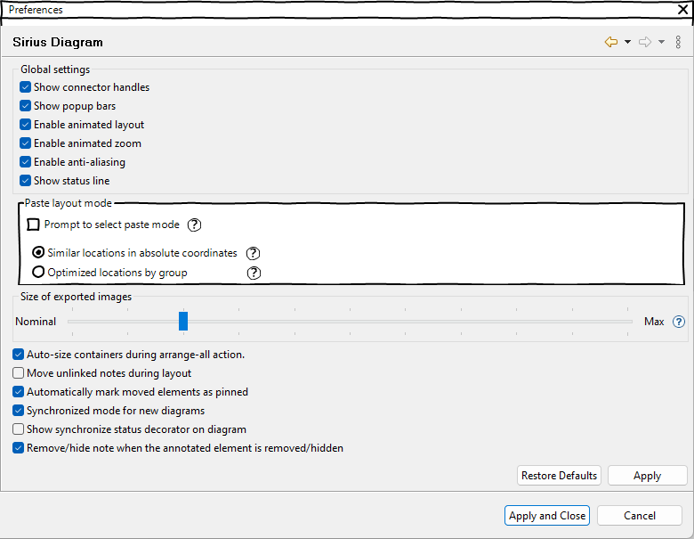
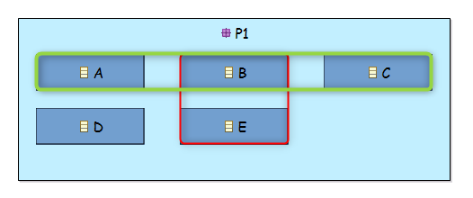
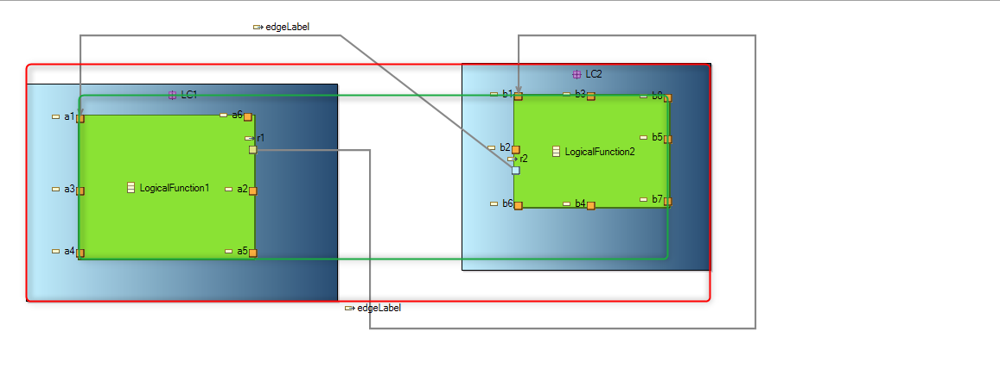
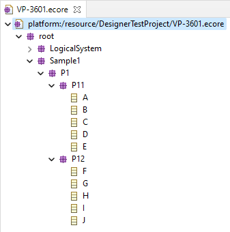
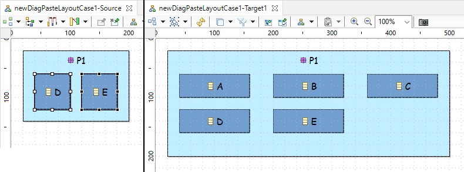
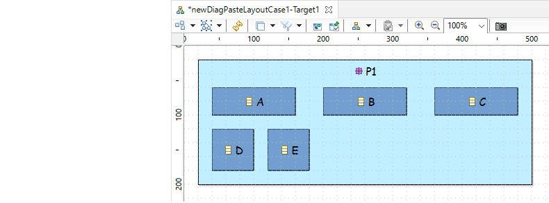
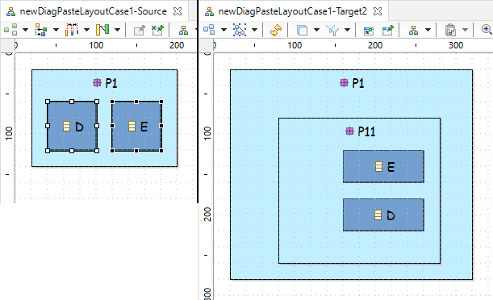
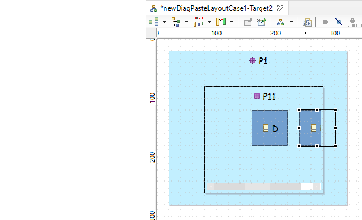
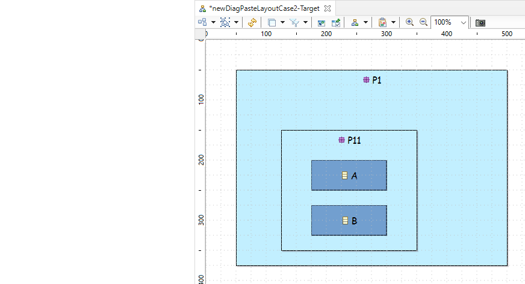
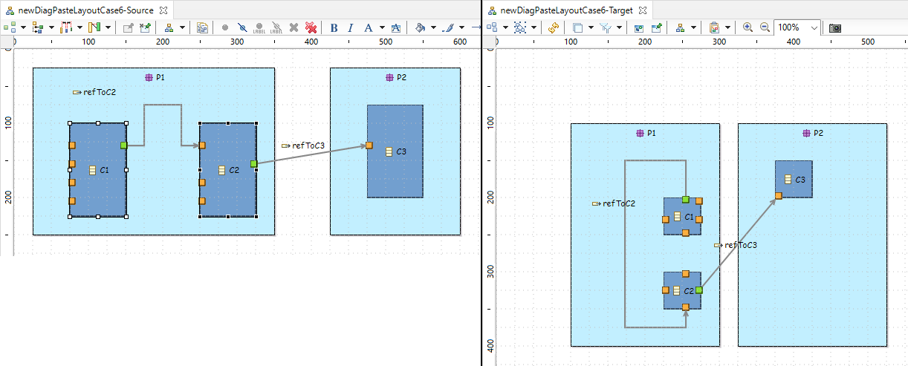

# Sirius Evolution Specification: Add a new mode to paste layout of elements

## Preamble

_Summary_: The goal of this evolution is to allow to choose between the current mode and a new mode when using the "Paste layout" or "Paste format" actions. This new mode keeps the same origin of the bounding box containing the elements having a copied layout to apply on.

A picture is worth a thousand words:

 

In the above example, in the new mode, the bounding box origin of `{175, 50}` is kept. The layout is applied by considering this origin.
In the current mode, there is overlap with other existing nodes.

| Version | Status    | Date       | Authors   | Changes           |
|---------|-----------|------------|-----------|-------------------|
|    v0.1 |  PROPOSAL | 2022-11-24 |  lredor   | Initial version.  |
|    v1.0 |  ACCEPTED | 2022-12-13 |  lredor   | Initial version.  |

_Relevant tickets_ (links to the Bugzilla tickets which are related to the change):

* [Bug 581115 - Add a new mode to paste layout of elements: "Bounding box" mode](https://bugs.eclipse.org/bugs/show_bug.cgi?id=581115)

## Introduction

After this evolution, a popup will appear after launching the "Paste format" or "Paste layout" action.

 

The user can select the desired paste mode:
* Absolute: Current behavior, the layout is applied to have the same location of the source elements with absolute coordinates, ie relatively to the origin of the diagram (coordinates `{0, 0}`).
* Bounding box: The children of a container having copied layout data is grouped, and the origin of bounding box remains unchanged. The layout of the children, ie brothers, is similar to each other.

In this popup, the user can check the box "Do not prompt to select paste mode, use last choice". If this box is checked, at the next execution of the "Paste" action, the popup will not be displayed and the last used mode will be used by default.

The user can modify this choice in the preferences: `Sirius/Sirius Diagram`.

 

This new mode is used either in "Paste format" or "Paste layout". The result is the same in both action.

## Detailed Specification

There are specific cases:
* If the layout data stored during the copy concern a hierarchy of elements and this hierarchy is also in the target, the behavior is slightly different. The "Bounding box" mode is considered only for the first level having layout data to apply to. Thus, the location of the children remain in relative mode with respect to their parent. This case is detailed farther in "Case 4 - Layout data hierarchy" of "Several samples" chapter.
    * If the hierarchy is lost, for example a data layout for a grand-parent but not for the parent, the nodes are "layouted", once again, according to the "Bounding box" mode. This case is detailed farther in "Case 5 - Layout data hierarchy broken" of "Several samples" chapter.
* This new mode does not concern border nodes. Copy the layout of one or several border nodes, without the layout of their parent, doesn't really make sense. But it is possible, with the absolute mode. For the border nodes, the result will be the same for the "bounding box" mode and the "absolute mode". The most common case will be to be in the case explained just above, ie border nodes and its parent layout are copied.

The next chapters details what is "the origin of the bounding box" and several cases with the expected behavior of the new mode.

### Origin of the bounding box

**Simple case**

The bounding box of elements if a rectangle containing all these elements. And the origin of a bounding box is the coordinates of the top-left corner of this rectangle.

For example in the following diagram:
* The bounding box of elements "B" and "E" is the red rectangle.
* The bounding box of elements "A", "B" and "C" is the green rectangle.

 

**More complexe case**

If the elements contain edges, labels of edges, border nodes, label of border nodes... The rule is always the same. The bounding box contains all these elements.

For example in the following diagram, the bounding box of all elements is the red rectangle.
 

### Several samples

The semantic model used is the following. The diagrams are unsynchronized and allow to represent packages and/or classes in one of its parents, in all parent hierarchy.

**Case 1 - Standard case**

If the "Copy format" is launched on classes "D" and "E", from "newDiagPasteLayoutCase1-Source" and the "Paste format" is done in "newDiagPasteLayoutCase1-Target1" with "Bounding box" mode, 

the expected result is the following: no overlap with other classes and the origin of the bounding box of "D" and "E" remains the same.

**Case 2 - Not same hierarchy and scrollbar**

If the "Copy format" is launched on classes "D" and "E", from "newDiagPasteLayoutCase1-Source" and the "Paste format" is done in "newDiagPasteLayoutCase1-Target2" with "Bounding box" mode, 

the expected result is the following: The origin of the bounding box of "D" and "E" remains the same. A scrollbar appears on "P11" because the class "E" overflows this container.

**Case 3 - Scrollbar**

If the "Copy format" is launched on classes "A" and "B", from "newDiagPasteLayoutCase2-Source" and the "Paste format" is done in "newDiagPasteLayoutCase2-Target" with "Bounding box" mode, 

the expected result is the following: The origin of the bounding box of "A" and "B" remains the same. A scrollbar appears on "P11" because the class "B" overflows this container.

**Case 4 - Layout data hierarchy**

For the same situation that case 3, but with a "Copy format" launched on package "P11", class "A" and class "B" (selection of classes "A" and "B" is optional, ie the result is the same with only "P11" selected, because the "Copy" action copies the layout data of the children too), the expected result is the following: The origin of the bounding box of "P11" remains the same. The "bounding box" mode is not considered for children of element having a layout data to paste, so "A" and "B" are moved without considering the bounding box.

**Case 5 - Layout data hierarchy broken**

If the "Copy format" is launched on the diagram "newDiagPasteLayoutCase5-Source" and the "Paste format" is done in "newDiagPasteLayoutCase5-Target" with "Bounding box" mode, 

the expected result is the following: The origin of the bounding box of "P1" remains the same. P1 is resized, causing scrollbars because "P11" is not concerned by the Paste (no layout date). The origin of the bounding box of "A" and "B" remains the same (no direct parent in the stored layout data).

**Case 6 - Edge and border nodes**

If the "Copy format" is launched on the diagram "newDiagPasteLayoutCase6-Source", with  and the "Paste format" is done in "newDiagPasteLayoutCase6-Target" with "Bounding box" mode, 

the expected result is the following: The origin of the bounding box of "C1", "C2", the edge and its labels remains the same.

## RCP/Web Flavors Compatibility and Interoperability

This feature will exist only in Sirius RCP. Indeed, the current "Copy/Paste format" actions are not implemented in Sirius Web, so the new mode neither.

## Backward Compatibility and Migration Paths

No migration is needed. The changes impact the UI and the result of Paste action.

### Metamodel Changes

There is no metamodel change necessary for this feature.
  
### API Changes

New API will be added concerning the preferences and their default values:
* `org.eclipse.sirius.diagram.ui.tools.api.preferences.SiriusDiagramUiPreferencesKeys.PREF_PROMPT_PASTE_MODE`: A boolean preference to say if the paste mode must be prompt at each "Paste format" or "Paste layout" action.
* `org.eclipse.sirius.diagram.ui.tools.api.preferences.SiriusDiagramUiPreferencesKeys.PREF_PASTE_MODE_ABSOLUTE`: A boolean preference for the paste mode, true for `Absolute` mode, false for `Bounding box` mode).
    * If the `PREF_PROMPT_PASTE_MODE` is true, this preference is used to pre-select the choice in the popup.
    * If the `PREF_PROMPT_PASTE_MODE` is false, this preference is used to automatically choose the Paste mode to apply.

### User Interface Changes

As explained in "Introduction":
* a new popup is displayed at each "Paste format/layout" action execution (according to preference value),
* a new preference page allows end-user to change the value.

### Documentation Changes

The New and Noteworthy documentation must be completed.

The chapter *[Copy/paste of format](https://www.eclipse.org/sirius/doc/user/diagrams/Diagrams.html#copy_paste_format)* of Sirius documentation must be completed.

## Tests and Non-regression strategy

The cases described in "Several samples" can be used as manual tests.

The classes `org.eclipse.sirius.tests.swtbot.layout.ContainerAndNodeCopyPasteFormatTest` and `org.eclipse.sirius.tests.swtbot.layout.EdgeCopyPasteFormatTest` can be completed.

`org.eclipse.sirius.tests.swtbot.clipboard.MultiSessionCopyPasteTest`
`org.eclipse.sirius.tests.swtbot.layout.BorderedNodeCopyPasteFormatTest`
`org.eclipse.sirius.tests.swtbot.layout.EdgeStabilityOnCopyPasteLayoutTest`
`org.eclipse.sirius.tests.swtbot.uml.CopyPasteFormatOfLabelOfBorderedNodeTest`
`org.eclipse.sirius.tests.swtbot.uml.CopyPasteLayoutOfPortsWithConflictWithNotPastedPortsTest`
`org.eclipse.sirius.tests.swtbot.uml.CopyPasteLayoutOfPortsWithConflictWithPastedPortsTest`

## Implementation choices and tradeoffs

There is no guarantee to cover specific cases not detailed in the "Detailed Specification".

Specific cases not currently covered by the current mode will not be covered by the new mode. For the same reasons, existing bugs in the current mode will not be fixed with the implementation of this new mode.