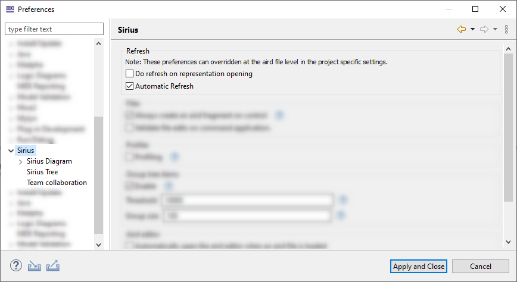
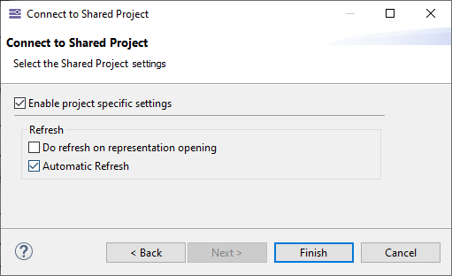
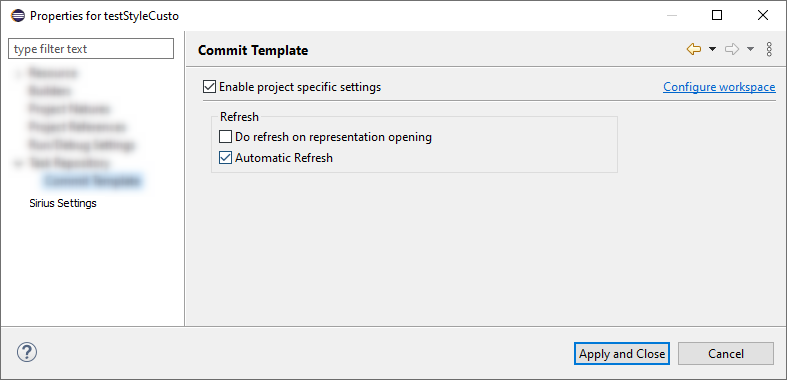

# Automatic refresh" and "Do Refresh on representation opening" management

## Preamble

_Summary_:
Currently, both Sirius preferences PREF_REFRESH_ON_REPRESENTATION_OPENING and PREF_AUTO_REFRESH are configurable with Window/Preferences/Sirius
That means that these preferences are associated to the workspace (Preference instance scope)

By default in Sirius, the values are :
* PREF_REFRESH_ON_REPRESENTATION_OPENING=true
* PREF_AUTO_REFRESH=true

These values are suitable for local projects but not for shared projects.
_Vocabulary_: A shared project is a Sirius project which resources are shared on a remote server.
This functionality is provided by other product or update site Example: Obeo Design Team Edition or Team For Capella.

The need is to have :
 1- the ability to set a specific behavior for local and shared project. By default:
* Local project: "Automatic refresh"=true and "Do Refresh on representation opening"=true
* Shared project: "Automatic refresh"=false and "Do Refresh on representation opening"=false

 2- the ability to change manually the preference for a given project

| Version | Status    | Date       | Authors   | Changes             |
|---------|-----------|------------|-----------|---------------------|
|    v0.1 |  PROPOSAL | 2020-01-07 |   lfasani | Initial version.    |

_Relevant tickets_:
* [Bug 570355 - Enhance "Automatic refresh" and "Do Refresh on representation opening" management ](https://bugs.eclipse.org/bugs/show_bug.cgi?id=456326): Sirius enhancement
* [Bug 456326 - Introduce a generic mechanism and API to pass configuration options to Sessions ](https://bugs.eclipse.org/bugs/show_bug.cgi?id=456326): Related ticket

## Functional Specification

The section describes the functionality and behavior as it is proposed.

### 1- Preferences for local and shared projects
The existing Sirius preferences remains and apply as default preference for local or shared project.

The default value is true for both preferences.

### 2- Overriding preferences
It is now possible to override the preferences for either a local or shared Session.
Note that there can be multiple aird file and then multiple `Session` in a single project.
So, to set the preferences at the Session level, the new preference Scope `SessionScope` is added.
The standard eclipse behavior is used. The preference is taken in this priority order in SessionScope otherwise in InstanceScope (Window/Preferences) otherwise in DefaultScope.

### 3-Project creation
At the project creation, the preferences may be set at the SessionScope.
The wizard that creates shared Session will provide a new page that is configured by default with the preferences that will set the SessionScope with
* PREF_REFRESH_ON_REPRESENTATION_OPENING=false
* PREF_AUTO_REFRESH=false

The user may uncheck "Enable session specific settings" and change the preferences value.

By default, "Enable project specific settings" is checked.
It is nevertheless possible to change the default value using the preference `CDOSiriusPreferenceKeys.PREF_ENABLE_PROJECT_SPECIFIC_SETTINGS_DEFAULT_VALUE`

### 4- How to change preferences afterwards
If the user wants to override the preference after the project/Session creation, he can do it by changing the aird file Settings: right click on the aird file then Properties/Sirius Settings. The user can check "Enable session specific Settings" and change the preferences.

## Technical Specifications

### Sirius API : Access and change the preferences

The method `SiriusPreferences Session.getSiriusPreferences()` is added.
The returned API allow to access and write preferences.
The search contexts, that is the look-up order used to access preferences,  is the following: SessionScope, InstanceScope, DefaultScope

The storeContext used to set preference values is the SessionContext.
The API provides methods to unset the value in the SessionContext.

Both `org.eclipse.sirius.business.api.preferences.SiriusPreferencesKeys.PREF_AUTO_REFRESH` and `org.eclipse.sirius.ui.business.api.preferences.SiriusUIPreferencesKeys.PREF_REFRESH_ON_REPRESENTATION_OPENING` **should not be accessed and written** using another API.

### Preferences persistence

When setting at the `SessionScope`, Both `org.eclipse.sirius.business.api.preferences.SiriusPreferencesKeys.PREF_AUTO_REFRESH` and `org.eclipse.sirius.ui.business.api.preferences.SiriusUIPreferencesKeys.PREF_REFRESH_ON_REPRESENTATION_OPENING` will be stored in the project setting:
* `SiriusPreferencesKeys.PREF_AUTO_REFRESH` will be stored in `project/.settings/org.eclipse.sirius.<sessionId>.prefs`
* `SiriusUIPreferencesKeys.PREF_REFRESH_ON_REPRESENTATION_OPENING` will be stored in `project/.settings/org.eclipse.sirius.ui.<sessionId>.prefs`

The `sessionId` is the uid of the DAnalysis of the main aird.

### Impacts on product using shared projects
As the preferences can be set at the Session scope, it is no longer useful to change the Default value of these preference.
The default value is the one in Sirius.
* PREF_REFRESH_ON_REPRESENTATION_OPENING=true
* PREF_AUTO_REFRESH=true

## Migration

There is no migration for existing projects. The Session scope will not be set automatically.

## RCP/Web Flavors Compatibility and Interoperability

This feature will be available only in Sirius Desktop (eclipse RCP)
