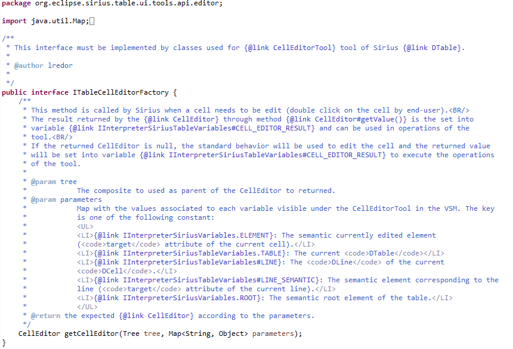

# Sirius Evolution Specification: Allow to specify the widget to edit the value of a cell in an edition table

## Preamble

_Summary_: The goal of this issue is to be able to provide a specific widget to edit the value of a cell in an edition table.

| Version | Status | Date       | Authors   | Changes           |
|---------|--------|------------|-----------|-------------------|
|    v0.1 |  DRAFT | 2021-02-11 |   lredor | Initial version.  |

_Relevant tickets_ (links to the Bugzilla tickets which are related to the change):

* [Bug 571115 - Allow to specify the widget to edit a value in an edition table](https://bugs.eclipse.org/bugs/show_bug.cgi?id=571115)

## Introduction

The goal of this issue is to be able to provide a specific widget to edit the value in an edition table.

Currently, the editor offered to edit a cell depends on the contents of the cell. It can be:
* a combo-box if the content can only be a value in a pre-defined list (enumeration);
* a check-box if the content is a boolean;
* a dialog box for many-valued references
* a text editor in all the other cases;

For example, in this table from Family sample, a "Combo box" is available to edit the cells of "Mother" column.

When the content of the column does not correspond to a "simple" feature, this "automatic" behavior is not possible and a simple text editor is proposed.

With this feature, the specifier could provide its `own org.eclipse.jface.viewers.CellEditor` for a specific feature column.

## Detailed Specification

For this enhancement, Obeo proposes that the specifier could precise a `CellEditorFactory` for each column. This factory will be responsible to return a specific `org.eclipse.jface.viewers.CellEditor` adapted to handle the content of the column. For the end-user, the behavior will be the same than with existing `CellEditor` provided by Sirius for "simple" feature, as explained above.

To provide its CellEditorFactory, the specifier will use a new tool named "Cell Editor". This new tool will be near the “Label Edit” tool.

A column can have only one "Label Edit" tool or one "Cell Editor" tool. These two tools are exclusive.

A "Cell Editor" tool will have the same variables has a "Label Edit" tool. The current variables, initialized in `org.eclipse.sirius.table.business.internal.metamodel.TableToolVariables.caseLabelEditTool(LabelEditTool)`, for a "Label Edit" tool are:
* element: The semantic currently edited element (`target` attribute of the current cell).
* table: The current `DTable`.
* line: The `DLine` of the current `DCell`.
* lineSemantic: The semantic element corresponding to the line  (`target` attribute of the current line).
* root: The semantic root element of the table.

These variables will be accessible directly in the `CellEditorFactory`. The specifier has the responsibility to return a `CellEditor` compliant with the expected value of the cell.
The "Cell Editor" tool will have only one property. The qualified class name of the `CellEditorFactory`. This class is a class of the Viewpoint Specification Project, like for [Java Extension](https://www.eclipse.org/sirius/doc/specifier/general/Writing_Queries.html#service_methods) declared the "Viewpoint".

The `CellEditorFactory` should implements the interface `org.eclipse.sirius.table.tools.internal.command.ITableCellEditorFactory`:

Currently, the `CellEditor` provided by Sirius is created in `org.eclipse.sirius.table.ui.tools.internal.editor.provider.DFeatureColumnEditingSupport.getBestCellEditor(EObject, boolean)`. It could be used as sample for specifier to provide their own `org.eclipse.jface.viewers.CellEditor`.

## RCP/Web Flavors Compatibility and Interoperability

This feature is only for Sirius Desktop.

## Backward Compatibility and Migration Paths

This is a new feature. There is no compatibility problem or migration expected.

### Metamodel Changes

The table metamodel, the part corresponding to the VSM, will be changed to add the new "Cell Editor" tool (in green in the below diagram).

The part corresponding to the aird file, it not really impacted as the `DCell` directly referenced the `CellUpdater` of the VSM part.

### API Changes

The only API changes are the above metamodel change and the addition of the interface `org.eclipse.sirius.table.tools.internal.command.ITableCellEditorFactory` to be implemented by the CellEditorFactory provided by the specifier.

### User Interface Changes

There is no real user interface changes for this feature. The change will be only visible when specifier will use this new feature. And it fully depends on the specifier implementation.

### Documentation Changes

The release notes and the "Column Tools" chapter in "[Feature Column Mappings](https://www.eclipse.org/sirius/doc/specifier/tables/Tables.html#feature_column_mapping)" will be completed.

## Tests and Non-regression strategy

The `org.eclipse.sirius.tests.swtbot.table.CellEditionTest` class will be completed with at least one specific `org.eclipse.jface.viewers.CellEditor` to validate this feature.

## Implementation choices and tradeoffs

The cross table is not in the scope of this issue. Nevertheless, it will be dealt if it is possible without additional cost.
