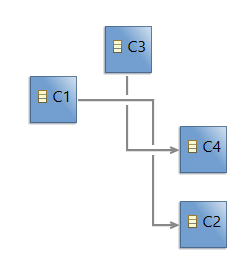
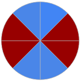
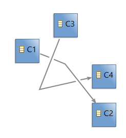
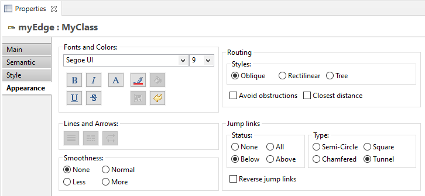
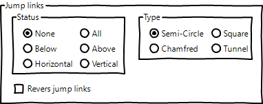
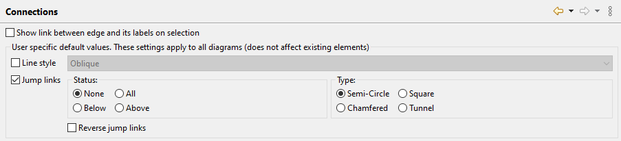
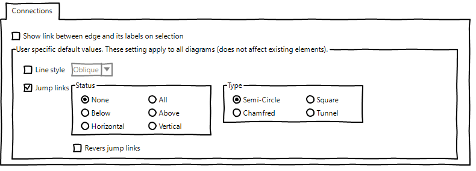

# Sirius Evolution Specification: New horizontal and vertical jump links status

## Preamble

_Summary_: The evolution of bugzilla [553775](https://bugs.eclipse.org/bugs/show_bug.cgi?id=553775) adds a new type of jump link, named "tunnel". The goal of this evolution is to continue to improve the readability of diagram having some edges crossing each other.

| Version | Status | Date       | Authors   | Changes           |
|---------|--------|------------|-----------|-------------------|
|    v0.1 |  DRAFT | 2021-06-09 | lredor    | Initial version.  |

_Relevant tickets_ (links to the Bugzilla tickets which are related to the change):

* [Bug 574237 - New horizontal and vertical jump links status](https://bugs.eclipse.org/bugs/show_bug.cgi?id=574237)

## Introduction

Currently, 4 status exist:
* None: Jump link is not activated on this edge.
* All: A jump link is created on this edge each time it intersects an edge.
* Below: A jump link is created on this edge each time it intersects an edge that is below it.
* Above: A jump link is created on this edge each time it intersects an edge that is above it.

The following illustrations correspond to the effect of these values (`None`, `All`, `Below` and `Above`) on a simple diagram.

 
 
 

For information, the edge between C1 and C2 is below the edge between C3 and C4 and the status is applied on both edges.

The goal of this evolution is to add 2 new kind of status. These new status are particular because they no longer depends on the "z-ordering" of the edges but on the alignment of the segements of the edge.

The new status are:
* Horizontal: A jump link is created on this edge each time it intersects an edge, when the segment on this edge is horizontal.
* Vertical: A jump link is created on this edge each time it intersects an edge, when the segment on this edge is vertical.

The following illustrations correspond to the effect of these new values (`Horizontal` and `Vertical`) on the same simple diagram.

 
 

Oblique segments will be also handled. Horizontality or verticality of an oblique segment is determined according to its angle. All segment in blue sections are considered as vertical and all segment in red sections are considered as horizontal.

 

The following illustration corresponds to the effect of `Horizontal` status on oblique edges.

Specific rules:
* For an horizontal status, if two oblique segments are considered as horizontal and cross each other, the "more" horizontal, according to its angle, has the jump link.
* For a vertical status, if two oblique segments are considered as vertical and cross each other, the "more" vertical, according to its angle, has the jump link.
* For edges with oblique segments, there is a potential limitation. If two oblique segments cross each other and the angles are exactly the "opposite", for example 50° and 130°, a specific rule is applied, the edge below the other has the jump.

## Detailed Specification

This Sirius evolution needs to use a new version of GMF, with a an evolution of GMF metamodel. Indeed, the values of status displayed in `Appearance` tab of Properties view rely on the enumeration `org.eclipse.gmf.runtime.notation.JumpLinkStatus`. A part of this evolution will be done in GMF (as for the addition of the new "Tunnel" type).
The code from `org.eclipse.gmf.runtime.draw2d.ui.figures.PolylineConnectionEx.JumpLinkSet.calculateIntersections(Connection)`  and `org.eclipse.gmf.runtime.draw2d.ui.figures.PolylineConnectionEx.setJumpLinksStyles(int, boolean, boolean, boolean, boolean)`  will be changed to consider these new statuses.
As a new version of GMF is necessary, the bugzilla [567876](https://bugs.eclipse.org/bugs/show_bug.cgi?id=567876) will be handled on GMF side to avoid code duplication in `org.eclipse.sirius.ext.gmf.runtime.draw2d.ui.figures.SiriusPolylineConnectionEx`. This class will be deleted after bugzilla 567876 resolution.

Sirius will be then adapted to benefit of this new GMF feature.

The jump links preferences, from page `org.eclipse.sirius.diagram.ui.internal.preferences.DiagramConnectionsPreferencePage` will be also completed with the new status.

## RCP/Web Flavors Compatibility and Interoperability

This feature will be available only in RCP as it is massively based on an existing GMF feature.

## Backward Compatibility and Migration Paths

### Metamodel Changes

The GMF version used will be different so a "blank" migration participant will be add (as for example `org.eclipse.sirius.diagram.business.internal.migration.JumpLinkNewTypeMigrationParticipant`). This version will not be compatible with previous version.
  
### API Changes

The API changes concern only the new jump links status.

### User Interface Changes

There are two user interface changes:
* the Appearance tab of the Properties view, when an edge is selected: it will be completed with the two new values for the jump links status
    * The existing Appearance tab of Properties view:

    * The "Jump links" block updated with new status values:

* the preference page "Sirius/Sirius Diagram/Connections": it will be completed with the two new values for the jump links status
    * The existing connection preference page:

    * The preference page after the evolution:

### Documentation Changes

This new status must be documented in the New and Noteworthy documentation.

The chapter corresponding to "Jump links" in Sirius documentation must be completed (in the section "Sirius/Sirius User Manual/Diagrams/Features Overview/Manage edges").

## Tests and Non-regression strategy

The result of this evolution is mainly visual. It is not possible to test it with automatic tests. Manual tests will be described.

## Implementation choices and tradeoffs

### New global preference with values "None / Horizontal / Vertical"

An option in which another preference will be added, with values "None / Horizontal / Vertical", has been studied. This preference will not be stored in the model (it is specific to each user with a potential default value defined in the product). It will be prior to other Status property.

The preference page will be something like:

#### Pros

* Avoid to impact GMF and indirectly avoid Sirius to use a new GMF version.

#### Cons

* Less comprehensible by end-user: A part of jump links behavior is handled threw properties another is handled threw preferences. A part is stored in the model, another part is stored in the workspace (preferences) ...
