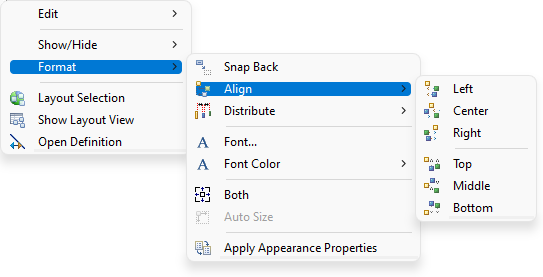
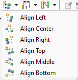
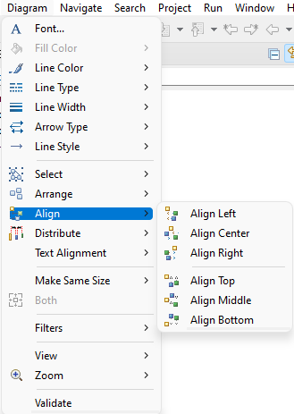

# Sirius Evolution Specification: Add align and distribute actions to edge labels

## Preamble

_Summary_: Currently, the align actions and distribute actions are available on shapes. The goal of the issue is to have a similar behavior for these actions on labels of edges.

| Version | Status | Date       | Authors   | Changes           |
|---------|--------|------------|-----------|-------------------|
|    v0.1 |  DRAFT | 2022-07-22 | lredor    | Initial version.  |

_Relevant tickets_ (links to the Bugzilla tickets which are related to the change):

* [Bug 580418 - Add align and distribute actions to edge labels](https://bugs.eclipse.org/bugs/show_bug.cgi?id=580418)

## Introduction

The goal of this feature is to have all align actions and distribute actions available when selecting labels of edges. The behavior will be similar that these actions for shapes.

## Detailed Specification

The align actions are contributed by GMF. Obeo has to override them by contributing new Sirius actions instead of GMF ones. The behavior has to be customized to enable these actions when selecting labels of edges.

The distribute actions have been added directly in Sirius, with bugzilla [442289](https://bugs.eclipse.org/bugs/show_bug.cgi?id=442289) in Sirius 2.0.0. As for align actions, the behavior has to be customized to enable these actions when selecting labels of edges.

The actions will be available on labels of all edges:
* labels of same edge,
* labels of different edges (even if the edges are not connected with same source and target).

So, on the contrary of shapes, the align actions are available for all kinds of labels. As reminder, for shapes, the actions are enabled only if the parent of all selected shapes is the same.

Even if the label is linked to an edge, these actions have no constraint according to the edge itself. In other words, the label location, after using this kind of actions, can be distant from its edge.

The align actions and distribute actions do not handle the overlap. Indeed according to the initial location of each label, the result of these actions can cause overlap between two labels.

The actions are enabled if it contains only a list of labels or a list of shapes. If the selection is a mix of shapes and labels, the actions are disabled.

As the labels of edges have no incidence on the "sequence" of elements, all the distribute and align actions will be available on sequence diagram when the selection is a list of edge labels.

For edges label, the actions will be available on the same locations:
* in the contextual menu: 
* in the tabbar of the diagram: 
* in the toolbar of Eclipse: 

### Technical details

* Align GMF actions, `org.eclipse.gmf.runtime.diagram.ui.actions.AlignAction`, must be overridden in Sirius.
* The policy `EditPolicy.PRIMARY_DRAG_ROLE` of edge label edit part, ie `org.eclipse.sirius.diagram.ui.graphical.edit.policies.ResizableShapeLabelEditPolicy`, must be adapted, override of `org.eclipse.gef.editpolicies.NonResizableEditPolicy.getAlignCommand(AlignmentRequest)`, to return the expected command to align the labels.
* The following methods must be adapted to also consider `org.eclipse.sirius.diagram.ui.internal.edit.parts.AbstractDEdgeNameEditPart`:
** `org.eclipse.sirius.diagram.ui.tools.internal.actions.distribute.DistributeAction.createOperationSet()`: to get a list of `AbstractDEdgeNameEditPart` (if the selection contains only `AbstractDEdgeNameEditPart`).
** `org.eclipse.sirius.diagram.ui.tools.internal.actions.distribute.DistributeAction.getTargetEditPartForDistributeSelection(List<?>)`: to get the diagram as parent when the `_operationSet` is a list of `AbstractDEdgeNameEditPart`.
** `org.eclipse.sirius.diagram.ui.internal.edit.commands.DistributeCommand.doExecuteWithResult(IProgressMonitor, IAdaptable)`: indirectly called by `org.eclipse.sirius.diagram.ui.internal.edit.parts.DDiagramEditPart.getCommand(Request)`.
** `org.eclipse.sirius.diagram.sequence.ui.tool.internal.edit.policy.SequenceContainerCreationPolicy.getDistributeCommand(DistributeRequest)`: to return the super getDistributeCommand when the selection is a list of edge labels, to enable the distribute actions on edge labels in a sequence diagram. No change is needed for align actions (these kind of actions are diqsabled in sequence diagram by an explicit override of getAlignCommand in corresponding EditPolicy (`AbstractFrameResizableEditPolicy`, `EndOfLifeSelectionPolicy`, `InstanceRoleResizableEditPolicy`...).

## RCP/Web Flavors Compatibility and Interoperability

This feature will be available only in RCP as it is massively based on an existing GMF feature.

## Backward Compatibility and Migration Paths

This feature does not need migration. The only changes concerns new actions with impacts on graphical location.

### Metamodel Changes

This feature does not need metamodel change.

### API Changes

The API changes concern only the new UI menus and/or actions.

### User Interface Changes

The visible changes concern the new menus and actions.

### Documentation Changes

These new actions must be documented in the New and Noteworthy documentation.
The documentation concerning [distribute](https://www.eclipse.org/sirius/doc/user/diagrams/Diagrams.html#distribute) actions must be completed.
There is currently no documentation concerning align actions in diagram user documentation. A section must be added (and also cover the labels of edges). This new section could be added in "Moving elements" section.
The "Moving elements" section could also contain "Distribute elements" and "Reset Diagram or Container Origin".

## Tests and Non-regression strategy

The existing `org.eclipse.sirius.tests.swtbot.DistributeActionTests` can be completed or a new class can be added for align and distribute actions on edge labels.

