# Sirius Evolution Specification: Keep "graphical elements without semantic link" after a Sirius graphical change

## Preamble

_Summary_: The goal of this feature request is to keep the "graphical elements without semantic link" after a Sirius graphical change. The "graphical elements without semantic link" are the notes, the representation links, the texts and the note attachments.

| Version | Status | Date       | Authors   | Changes           |
|---------|--------|------------|-----------|-------------------|
|    v0.1 |  DRAFT | 2023-04-14 |   lredor  | Initial version.  |
|    v0.2 |  DRAFT | 2023-04-18 |   lredor  | Amend scenarios.  |

_Relevant tickets_ :

* [Bug 581811 - Change purely graphical elements behavior according to drag'n'drop or deletion of Sirius diagram elements ](https://bugs.eclipse.org/bugs/show_bug.cgi?id=581811)

## Introduction

In Sirius, there are 4 "graphical elements without semantic link". These concepts are purely graphical, they have no effect on the semantic model and the semantic model has no impact on them. In the rest of the specification, we talk about "purely graphical elements" for these concepts. All the tools allowing to create them are grouped in the same drop-down menu in the palette:

The notes, the representation links and the texts can be created on the diagram or in a container.
The note attachments link a purely graphical element (a `Note`, a `Representation Link`, a `Text` or another `Note Attachment`) to another object. This object is most of the time a Sirius graphical element, which correspond to a semantic element. But it can also be another purely graphical element.

After some change on the diagram, some "graphical elements without semantic link" can be lost without obvious reason for the end-user. Technically, these elements are sometimes removed because the original annotated Sirius graphical element has been removed. But according to the end-user, the Sirius graphical element is the same (even if technically, this is a new one, created by the Sirius refresh mechanism).

The below example is a simple case to clarify the problem.

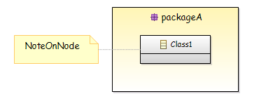

The above diagram is a sample before doing a drag'n'drop of "Class1" from the container "packageA" to the diagram.

* The "packageA" and "Class1" are Sirius graphical elements, with respectively a link with semantic elements "packageA" and "Class1".
* The "NoteOnNode" is a purely graphical concept, a `Note`.
* The link between "NoteOnNode" and "Class1" is a `NoteAttachment`.

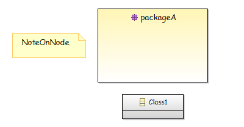

The above diagram is the current result after doing the drag'n'drop of "Class1" from the container "packageA" to the diagram. As you can see, the link between "NoteOnNode" and "Class1" has been lost. This is a typical sample of problem that this feature must resolve.

## Detailed Specification

When you perform certain actions on a diagram, multiple refreshes are technically involved:
* Firstly, the executed tool makes semantic changes (according to what has been coded in your modeler).
* Then, a Sirius refresh is called to (re)compute the Sirius graphical elements to display in the diagram (called `DDiagramElement`), according to the semantic elements state.
* Then, the GMF nodes and edges are refreshed according to Sirius graphical elements. The GMF nodes are somehow the link between the Sirius graphical elements and the corresponding "figures" drawn in the diagram.

The purely graphical elements only exist on the "GMF nodes and edges layer". In the above simple sample:
* The tool moves the "Class1" from "packageA" to container of "packageA", ie the semantic package associated to the diagram.
* The Sirius refresh identifies that the semantic element "is the same" and reuses the existing DDiagramElement.
* But at the "GMF nodes and edges layer", a new node is created and the original node, at which the Note was connected, no longer exists. So the note attachment is removed during the "GMF nodes and edges refresh".

Only scenarios described bellow will be handled by this feature request. Indeed, the refresh mechanism is complex. It can be "amended" by specific extension point. For this reason, there is no guarantee that a scenario not explained here will be covered.

Globally, the goal is to keep the purely graphical elements if after the tool execution, we are able to find one, and only one, GMF created node with the same DDiagramElement or with the same semantic element, than the after original linked element.

All the below scenarios used data available in [gerrit 201382](https://git.eclipse.org/r/c/sirius/org.eclipse.sirius/+/201382).

### Scenario A - Drag'n'drop of a Node from a container to the diagram, with a Note linked to this Node. The mapping is the same before and after the drag'n'drop.
* Open diagram "scenarioA-diagramWithNodeDnDAndSameMapping-simple"

* Drag'n'drop the node "ClassA" to the diagram
* **Expected**: The note "NoteOnNode" is always linked to the node "ClassA".
* **Observed**: The note "NoteOnNode" is no longer linked to the node "ClassA".

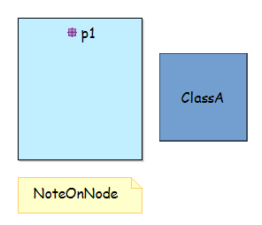

* This scenario can be the replayed with:
    * a Container, an Element Based Edge or a Representation Based Edge instead of the Node,
    * a Representation Link or a Text instead of the Note
    * with the purely graphical element on source side or on target side

### Scenario B - Drag'n'drop of a Container having sub-nodes and edges linked to purely graphical elements (even with Note associated to another representation link)
* This scenario is similar to scenario A but with more complex structure of elements.
* Open diagram "scenarioB-diagramWithContainerDnDAndSameMapping"

* Drag'n'drop the container "p11" to the container "p2"
* **Expected**: The notes are always linked to the moved elements.
* **Observed**: The notes are no longer linked to the moved elements. "Ghost" note attachments exist after the drag'n'drop (caused by [bugzilla 581751](https://bugs.eclipse.org/bugs/show_bug.cgi?id=581751).

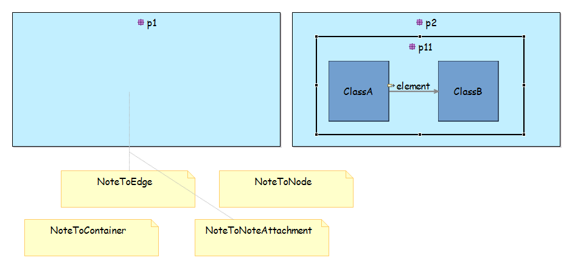

### Scenario C - Drag'n'drop of a Node from a container to the diagram, with a Note linked to this Node. The mapping is not the same before and after the drag'n'drop.
* Open diagram "scenarioC-diagramWithNodeDnDAndMappingChange-simple"

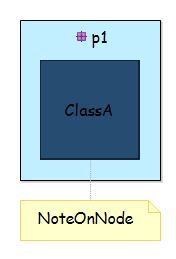

* Drag'n'drop the node "ClassA" to the diagram
* **Expected**: The note "NoteOnNode" is always linked to the node "ClassA".
* **Observed**: The note "NoteOnNode" is no longer linked to the node "ClassA".

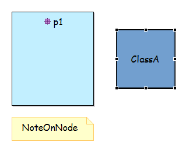

* This scenario can be the replayed with:
    * a Container, an Element Based Edge or a Representation Based Edge instead of the Node,
    * a Representation Link or a Text instead of the Note
    * with the purely graphical element on source side or on target side
    
### Scenario D - On an unsynchronized diagram, drag'n'drop of a Node from a container to the diagram, without a real drag'n'drop but a remove of the view. The expected result is a deletion of the NoteAttachment.
* Open diagram "scenarioD-diagramWithFakeNodeDnD"

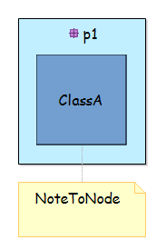

* Drag'n'drop the node "ClassA" to the diagram
* **Expected**: The node "ClassA" no longer exists and the note "NoteOnNode" is always here. The note should be removed if the preference "Remove/hide note when the annotated element is removed/hidden" is checked.
* **Observed**: OK, except if the preference is checked.

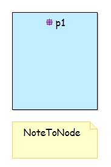

### Scenario E - Drag'n'drop of a Container from Model Explorer view that changes the existing hierarchy in the diagram, the impacted elements are linked to purely graphical elements 
* Open diagram "scenarioE-diagramWithUnsynchronizedHierarchy"

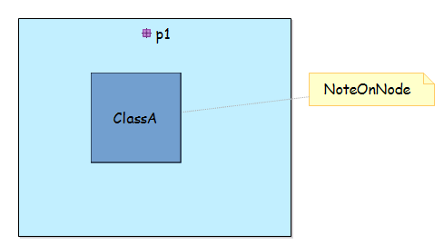

* Drag'n'drop the package "p1-1" from the Model Explorer view to the diagram editor, in the package "p1"
* **Expected**: The package "p1-1" is created into the package "p1". The node "ClassA" is moved into the package "p1-1". The note "NoteOnNode" is always linked to the node "ClassA".
* **Observed**: The note "NoteOnNode" is no longer linked to the node "ClassA".

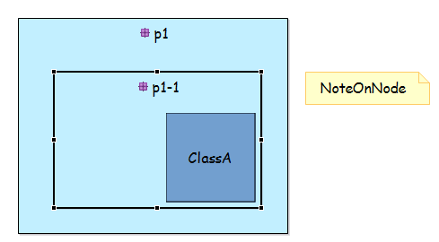

* Select the package "p1-1" and delete it (Delete from Model). The delete is overridden in the VSM. It only deletes the corresponding view and moves the view corresponding to node "ClassA".
* **Expected**: The package "p1-1" is no longer visible in the diagram. The node "ClassA" is moved into the package "p1". The note "NoteOnNode" is always linked to the node "ClassA".
* **Observed**: The note "NoteOnNode" is no longer linked to the node "ClassA".
* This scenario can be the replayed with:
    * a Representation Link or a Text instead of the Note
    * with the purely graphical element on source side or on target side

### Scenario F - Drag'n'drop of a Container containing a Note from a Container to the diagram
* Open diagram "scenarioF-diagramWithContainerDnDAndSameMapping-simple"

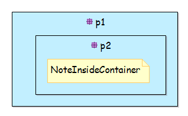

* Drag'n'drop the package "p2" from "p1" to the diagram
* **Expected**: The note "NoteInsideContainer" is always visible.
* **Observed**: The note "NoteInsideContainer" has been removed.

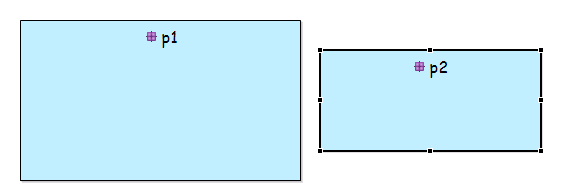
* This scenario can be the replayed with:
    * a Representation Link or a Text instead of the Note

## RCP/Web Flavors Compatibility and Interoperability

This feature request concerns element inherited from GMF framework, so existing only on RCP side. So by definition, it does not concern Sirius Web.

## Backward Compatibility and Migration Paths

This evolution does not change any API.

### Metamodel Changes

There is no change to the Sirius metamodel. Only the behavior concerning the purely graphical elements is impacted.
  
### API Changes

The impacted code concerns internal refresh mechanisms, so no API will be concerned. For details, the main impacted classes will be:
* org.eclipse.sirius.diagram.ui.internal.refresh.diagram.DDiagramCanonicalSynchronizer
* org.eclipse.sirius.diagram.ui.internal.refresh.AbstractCanonicalSynchronizer (the super class of the above one)

### User Interface Changes

Only the behavior concerning the purely graphical elements is impacted. There is no real user interface change.

### Documentation Changes

The New and Noteworthy documentation must described the new behavior.

## Tests and Non-regression strategy

The impacted code is major and is called regularly, all the scenario of this specification must be covered by a specific test.

## Implementation choices and tradeoffs

Only the scenarios described in this specification are guaranteed to be covered. The refresh mechanism is too complex to guarantee all scenario in generic way.
