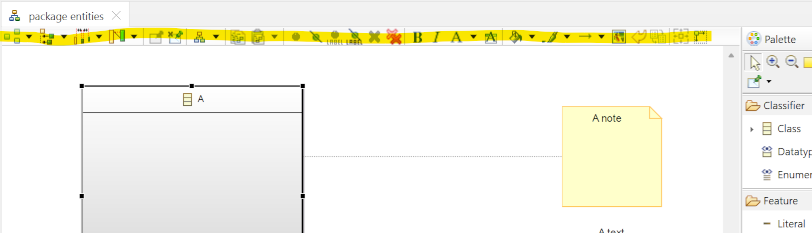
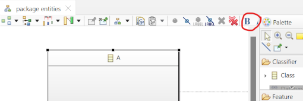
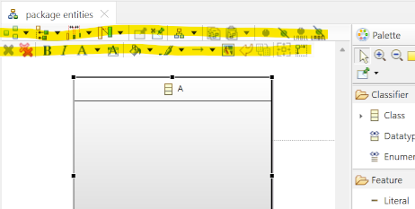
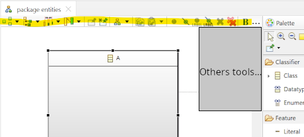
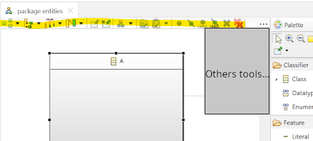

# Sirius Evolution Specification: The new place of hidden tools when tool bar have small size

## Preamble

_Summary_: When the size of window is too small, the tool bar cannot show all tools, so we can do something with items that cannot be shown.

| Version | Status    | Date       | Authors   | Changes           |
|---------|-----------|------------|-----------|-------------------|
|    v0.1 |  DRAFT    | 2023-06-29 |   scosta  | Initial version.  |

_Relevant tickets_ :

* [Bug 582149 - Provide a way to access to all tools contained in Diagram inner Toolbar when Diagram size is reduced ](https://bugs.eclipse.org/bugs/show_bug.cgi?id=582149)

## Introduction

When the window is large enough to display all tools (highlighted in yellow on screenshot) :

When the window is not large enough to display all tools, some tools are hidden (all tools after bold button are hidden) :

In this specification, I propose 3 solutions for this problem:
- put hidden tools on new line
- put hidden tools in menu at the end of tool bar
- put hidden section in menu at the end of tool bar

## Hidden tools on new line
When size is not large enough to display all tools, a new line is create to put all items:

## Hidden tools in menu
When size is not large enough to display all tools, a new button `...` is create at the end and open menu on click:

This menu contain all missing tools, each tools have its icon, name and if tool have menu, we sub menu and separator are reported in menu.

## Hidden section in menu
Same as `Hidden tools in menu` solution but avoid to break section between the tool bar and menu extension

Here, we have enough space to put bold button in the tool bar but not other buttons of font section, so, we put also bold button in menu.
