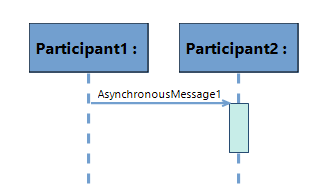
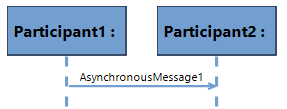
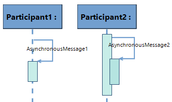
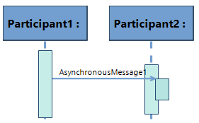
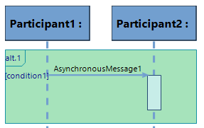
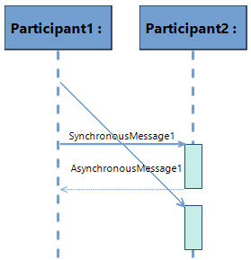

# Sirius Evolution Specification: Handle oblique asynchronous messages in sequence diagram

## Preamble

*Summary*: This document describes the existing features for asynchronous messages, and lists the features that must be supported by oblique asynchronous messages.

| Version | Status | Date | Authors | Changes |
| --- | --- | --- | --- | --- |
| v0.1 | DRAFT | 2025-04-17 | Glenn Plouhinec | Initial version. |

*Relevant tickets*:
* [Sirius Desktop - Issue #587 - Sequence diagram: Support oblique asynchronous messages](https://github.com/eclipse-sirius/sirius-desktop/issues/587)

## Introduction

### Existing features for Asynchronous messages

1. Currently, when an **Async Call** is created on a Interaction diagram between two **Participants**, it is created with an **Execution**. The *finishing end* of the message is the start of the execution.
	* 
2. If the **Execution** is removed, the **Message** still exists, its *starting end* and *finishing end* don't move.
	* 
3. An **Async Call** can be created even if the source and target is the same **Participant** or **Execution**
	* 
4. An **Async Call** can be created on an **Execution** as source and another one as target. A new **Execution** is created at the target point.
	* 
5. An **Async Call** can be created in a **Combined Fragment** or **Operand**, but it can't have a source neither target for which the context is different, i.e. an **Async Call** cannot have an **Execution** in a **Combined Fragment** as a target if the source of the **Async call** is not in the same **Combined Fragment**.
	* 
6. An **Async Call** can be moved up and down to be reordered. Its *starting end* and *finishing end* are reordered consequently in the list of **Ends**.

### Expecting features for oblique Asynchronous messages
1. An oblique **Async Call** can be created from a **Participant** or **Execution** to another **Participant** or **Execution**. The *starting end* of the message must be ordered **before** its *finishing end*.
	* For example in this case, the order of ends are the following:
	 * 1: starting end of AsynchronousMessage1
	 * 2: starting end of SynchronousMessage1
	 * 3: finishing end of SynchronousMessage1
	 * 4: starting end of the reply
	 * 5: finishing end of the reply
	 * 6: finishing end of AsynchronousMessage1
	 * 7: finishing end of Execution2
	 * 
2. It should not be possible to create an oblique **Async Call** if its *finishing end* is ordered before its *starting end*
3. The source or target of an **Async Call** (horizontal or oblique) can be reconnected to get an oblique **Async Call**. The reconnect action must be forbidden if its *starting end* is reconnected after the *finishing end*, or if the *finishing end* is reconnected before the *starting end*

## API Changes

## Documentation

We'll update documentation of sequence diagrams in `Sirius > Sirius User Manual > Sequence Diagrams`

## Tests and Non-regression strategy
