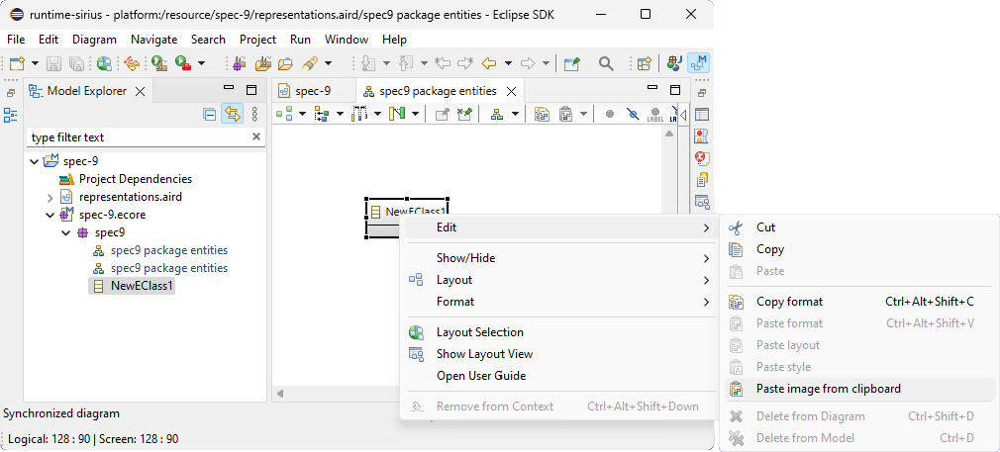
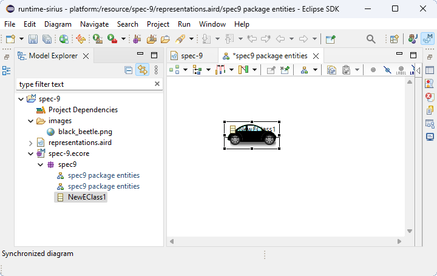

# Sirius Evolution Specification: image past on nodes in diagram from clipboard

## Preamble

_Summary_: This document describe the new feature to past image on nodes or containers in diagram from clipboard

| Version | Status    | Date       | Authors   | Changes           |
|---------|-----------|------------|-----------|-------------------|
|    v0.1 |  DRAFT    | 2023-07-07 |   scosta  | Initial version.  |

_Relevant tickets_ :

* [#9 - Allow the image paste on nodes in diagram from clipboard](https://github.com/eclipse-sirius/sirius-desktop/issues/9)

## Specification

The proposed solution is to add an entry `Past image from clipboard` to the `edit` menu and, in toolbar, with past style dropdown button.

This action will be enabled if there is an image in the clipboard and if the elements selected can have workspace image style.

The past style dropdown button is disabled if all paste actions are disabled.
The default action of past style dropdown button is the last used and enabled if there are enabled action and the last used disabled if all action are disabled.

After pasting the image, the image file is created in the folder `images` in project and the style of selected element is workspace image referencing the created image.

