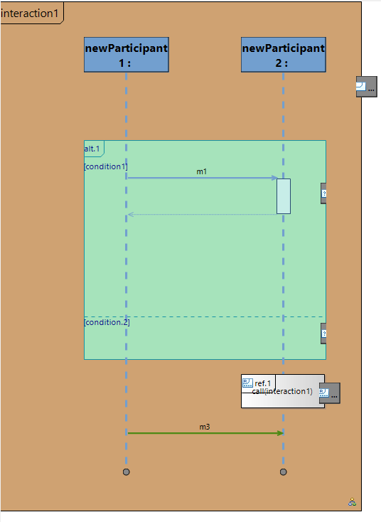
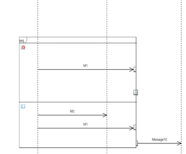

# Sirius Evolution Specification: Ajout des Gates sur diagrammes de séquences

## Preamble

_Summary_: This document describe the addition of an "Gate" mapping to the sequence diagram, border nodes on Combined Fragments, Interaction Use or Interaction Container that can be connected by messages.

| Version | Status    | Date       | Authors   | Changes           |
|---------|-----------|------------|-----------|-------------------|
|    v0.1 |  DRAFT    | 2025-04-14 | smonnier  | Initial version.  |

_Relevant tickets_ :

* "Sequence diagram: Support Gates":https://github.com/eclipse-sirius/sirius-desktop/issues/590

## Introduction

Dans les diagrammes de séquence Papyrus Legacy, il est possible de placer des « Gates » afin de représenter des échanges venant ou allant vers des composants externes. Le but de cette évolution est d'introduire les "Gates" dans les diagrammes de séquence Sirius.

### Identified issues

* D'un point de vue utilisateur, il parait logique qu'une Gate puisse être par des messages connecté en entrée et en sortie. Cependant, la spec UML ne permet de connecter qu'un seul message à une Gate. Sémantiquement, il faut une gate pour l'entrée, une pour la sortie et un nom en commun pour les lier. Graphiquement on peut représenter les deux gates sémantiques par un seul DiagramElement.

## Specification

### Goals

* Afficher les gates sur les diagrammes de Séquence Sirius.

* Afficher les gates sur les diagrammes de Séquence Papyrus.

### Quick analysis

* Afin de pouvoir représenter des Gates, il faudra ajouter au métamodel de diagramme de séquence (org.eclipse.sirius.diagram.sequence.model/model/sequence.ecore) le concept de "GateMapping".
* Il faudra que les "GateMappings" puissent être ajoutés en border node de "InteractionContainerMapping", "CombinedFragmentMapping" et "InteractionUserMapping".
* Il faudra des tools de création et suppression de GateMapping. Il n’y aura pas de tool de reconnexion (pas de drag and drop de Gate d’un Operand à un autre).
* La norme UML associant une "Gate" à un seul message, les "Gate" liées doivent porter le même nom. Il faudra donc afficher le nom des Gates sur le diagramme. Nous pourrons ajouter un filtre pour pouvoir facilement cacher tous ces labels.
* Concernant les Gates sur des CombinedFragment, il n’y aurait plus de différenciation graphique pour une Gate "interne", "externe" et "non connecté". 
* Les gates auront leur propre GateEditPart et leur propre border item locator. Il faudra alors un border item locator custom afin que les border nodes soit bien a cheval sur la bordure du combined fragment.
* Il sera nécessaire de mettre à jour SequenceHorizontalLayout et SequenceVerticalLayout afin de prendre en compte les Gates.
* Supprimer un message connecté à une "Gate", supprimera aussi la "Gate".
* Il est à noter qu’il faudra prendre en compte les "messages asynchrones" qui sont aussi à l’étude.

### API Changes

Il y aura de nouvelles classes (MM, editpart...) mais il ne devrait y avoir que des ajouts, pas de changement API prévu.

### Documentation

La documentation utilisateur de Sirius concernant les diagrammes de séquence devra être mise à jour afin de présenter les Gates.
La documentation specifier de Sirius concernant les diagrammes de séquence devra être mise à jour afin de présenter les GatesMapping.

## Tests and Non-regression strategy

Afin de pouvoir tester les évolutions apportées par les parties précédentes, il sera nécessaire d’ajouter le concept de Gate dans le jeu d’essai « Interaction » de Sirius.
Il faudra ajouter un border node GateMapping à InteractionContainerMapping (bordure ouest et est).
Il faudra ajouter un border node GateMapping à OperandMapping (bordure ouest et est).
Il faudra ajouter un border node GateMapping à InteractionUseMapping (bordure ouest et est).
GateMapping sera une source et cible du mapping « Call Message ».
Il sera nécessaire d’ajouter un tool de création et de suppression de Gate. Cependant, il n’y aura pas de tool de reconnection.

Il sera nécessaire d’ajouter une nouvelle classe de test SWTBot afin de valider l’affichage mais aussi les drag and drop de message présentés précédemment.